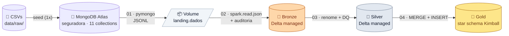
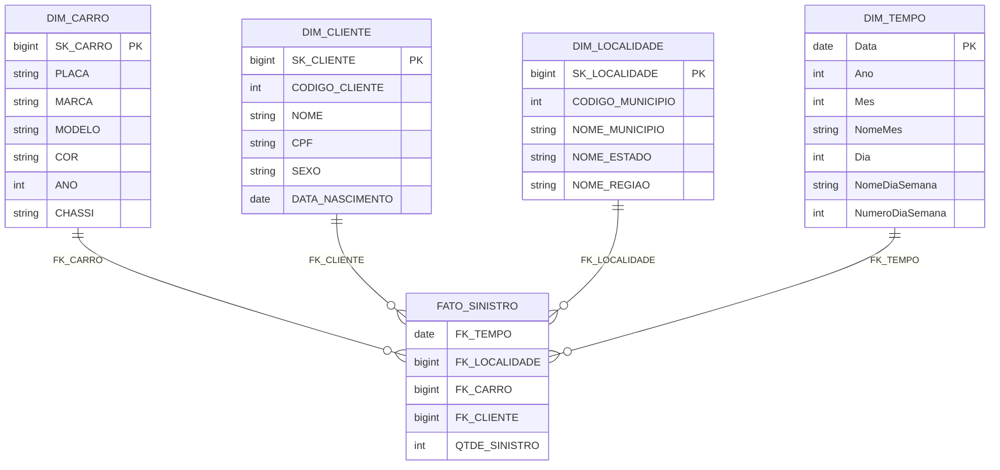

<div align="center">

# 🏛️ Databricks Lakehouse Medalhão — MongoDB

**Trabalho 3 — Lakehouse com Databricks Free Edition e Arquitetura Medalhão**

Aluno: **Gustavo Dias e Lucas Oliverio**

---

[](https://www.databricks.com/learn/free-edition)
[](https://www.mongodb.com/atlas)
[](https://delta.io/)
[](https://www.python.org/)
[](https://spark.apache.org/docs/latest/api/python/)
[](https://squidfunk.github.io/mkdocs-material/)
[](https://gustavofelisbino.github.io/Databricks-Lakehouse-Medalhao-Mongo/)

</div>

---

## 📋 Sobre o Projeto

Pipeline de dados **end-to-end** no Databricks Free Edition implementando a **arquitetura Medallion** (Landing → Bronze → Silver → Gold), com origem em **MongoDB Atlas** (banco não-relacional, livre escolha do trabalho) e modelo dimensional **Ralph Kimball** no Gold. Todas as etapas são orquestradas por **um único Job** com 5 tasks sequenciais.

Domínio: **seguradora de automóveis** — 11 tabelas (apólices, sinistros, clientes, carros, modelos, marcas, endereços, telefones, municípios, estados, regiões).

### 🎯 Cobertura do enunciado

| # | Etapa | Onde |
|---|---|---|
| 1 | Extração de banco real (relacional **ou** não relacional) → `LANDING/DADOS` | `01_landing_extracao_mongo.py` (MongoDB Atlas → JSONL) |
| 2 | Landing → Bronze (Delta Lake) | `02_bronze_ingestao.py` |
| 3 | Bronze → Silver com Data Quality | `03_silver_data_quality.py` |
| 4 | Silver → Gold (Ralph Kimball) | `04_gold_dimensional.py` |
| 5 | Tudo encadeado por Job (Jobs & Pipelines) | `databricks_job.yml` + UI |

---

## 🏗️ Arquitetura



Orquestração: **1 Job no Databricks** com 5 tasks sequenciais e dependência linear (`setup → landing → bronze → silver → gold`).

---

## 🧱 Camadas

| Camada | Schema/Volume | Formato | Conteúdo |
|---|---|---|---|
| 🟦 **Landing** | `workspace.landing.dados` | JSONL | Dump bruto do Mongo, 1 arquivo por collection |
| 🟫 **Bronze** | `workspace.bronze.*` | Delta managed | + auditoria (`data_hora_bronze`, `nome_arquivo`) |
| ⚪ **Silver** | `workspace.silver.*` | Delta managed | Renome (UPPER + expansão), trim, dedup, drop `_id`, auditoria silver |
| 🟡 **Gold** | `workspace.gold.*` | Delta managed | 4 dimensões + 1 fato (Kimball star schema) |

### Regras de Data Quality (Silver)

Renome de colunas (UPPER + expansão de prefixos):

| De | Para |
|---|---|
| `CD_` | `CODIGO_` |
| `VL_` | `VALOR_` |
| `DT_` | `DATA_` |
| `NM_` | `NOME_` |
| `DS_` | `DESCRICAO_` |
| `NR_` | `NUMERO_` |
| `_UF` | `_UNIDADE_FEDERATIVA` |

Mais: `trim` em strings, `dropDuplicates`, drop de `_ID`/auditoria bronze, adição de `NOME_ARQUIVO_BRONZE` + `DATA_ARQUIVO_SILVER`.

---

## ⭐ Modelo Dimensional (Gold)



- **Estratégia das dimensões:** SCD Type 1 via `MERGE INTO`.
- **`dim_tempo`:** gerada por `spark.range` cobrindo `2023-01-01 → 2026-12-31` (1461 linhas).
- **`fato_sinistro`:** carga full reload (`TRUNCATE + INSERT … SELECT`) com `COUNT(1)` agrupado por `(dia, localidade, carro, cliente)`.

---

## ✅ Pré-requisitos

Tudo é feito via **navegador** + duas contas free. Não precisa instalar nada local.

| Recurso | Plano | Link |
|---|---|---|
| **Databricks Free Edition** | gratuito (Serverless habilitado) | [databricks.com/learn/free-edition](https://www.databricks.com/learn/free-edition) |
| **MongoDB Atlas M0** | gratuito (512 MB, 1 cluster) | [mongodb.com/atlas](https://www.mongodb.com/atlas) |
| **GitHub** | conta pública | [github.com](https://github.com) |
| _(opcional)_ **Databricks CLI** | `pip install databricks-cli` | [docs.databricks.com/dev-tools/cli](https://docs.databricks.com/dev-tools/cli/) — só pra Secret Scope |

> ⚙️ **Compute:** todas as tasks rodam em **Serverless** (cold start de ~30 s na primeira execução).
>
> 🔐 **Credencial Mongo:** dois caminhos cobertos pelo notebook — Secret Scope (preferido) ou Job Parameter (100 % UI, sem CLI).

---

## 🚀 Como executar (resumo)

O passo-a-passo completo, com prints e troubleshooting, está em **[`docs/runbook-databricks.md`](docs/runbook-databricks.md)**. Resumindo:

### 1. MongoDB Atlas (1x)

1. Cria cluster M0 → **Network Access:** libera `0.0.0.0/0`.
2. **Database Access:** cria usuário com senha.
3. **Connect → Drivers** → copia a connection string.

### 2. GitHub → Databricks

1. Faz fork/clone deste repo no GitHub.
2. No Databricks: **Workspace → Add → Git folder** → URL do repo, branch `main`.

### 3. Credencial Mongo

<details>
<summary><b>Opção A — Secret Scope (recomendado)</b></summary>

```bash
pip install databricks-cli
databricks auth login --host https://<seu-workspace>.cloud.databricks.com
databricks secrets create-scope mongo
databricks secrets put-secret mongo uri
# (cole a connection string quando solicitado)
```

</details>

<details>
<summary><b>Opção B — Job Parameter (100% UI)</b></summary>

Pula o secret scope. A connection string vira parâmetro `MONGODB_URI` na task `landing` do Job (Passo 5 do runbook).

</details>

### 4. Setup e seed (manual, uma vez)

| # | Ação |
|---|---|
| 1 | Roda `notebooks/00_setup_ambiente.py` |
| 2 | **Catalog Explorer → workspace → landing → csv_raw → Upload** → seleciona os 11 CSVs de `data/raw/` |
| 3 | Roda `notebooks/00b_seed_csv_para_mongo.py` (popula o Atlas) |
| 4 | (sanity) Roda `notebooks/01_landing_extracao_mongo.py` — deve gerar 11 `.json` no Volume |

### 5. Cria e roda o Job

UI → **Jobs & Pipelines → Create Job** → nome `pipeline_seguradora_medalhao`, com 5 tasks:

| # | Task | Notebook | Depends on |
|---|---|---|---|
| 1 | `setup` | `notebooks/00_setup_ambiente` | — |
| 2 | `landing` | `notebooks/01_landing_extracao_mongo` | `setup` |
| 3 | `bronze` | `notebooks/02_bronze_ingestao` | `landing` |
| 4 | `silver` | `notebooks/03_silver_data_quality` | `bronze` |
| 5 | `gold` | `notebooks/04_gold_dimensional` | `silver` |

→ **Run now** → DAG verde → ✅

### 6. Valida no SQL Editor

```sql
SHOW SCHEMAS IN workspace;                   -- landing, bronze, silver, gold
SHOW TABLES IN bronze;                       -- 11 tabelas
SHOW TABLES IN silver;                       -- 11 tabelas
SHOW TABLES IN gold;                         -- 5 (4 dim + 1 fato)
SELECT COUNT(*) FROM gold.fato_sinistro;     -- > 0
SELECT COUNT(*) FROM gold.dim_tempo;         -- 1461
```

---

## 📁 Estrutura do Repositório

```
Databricks-Lakehouse-Medalhao-Mongo/
├── README.md                              # este arquivo
├── mkdocs.yml                             # config MkDocs Material
├── databricks_job.yml                     # Asset Bundle do Job (5 tasks)
├── .gitignore
│
├── notebooks/                             # 7 notebooks Databricks (.py source)
│   ├── 00_setup_ambiente.py               # 🏗️  cria schemas + volumes
│   ├── 00b_seed_csv_para_mongo.py         # 🌱  popula Atlas a partir dos CSVs (1x)
│   ├── 01_landing_extracao_mongo.py       # 🟦  Mongo → JSONL no Volume
│   ├── 02_bronze_ingestao.py              # 🟫  JSONL → Delta managed
│   ├── 03_silver_data_quality.py          # ⚪  DQ + renome + auditoria
│   ├── 04_gold_dimensional.py             # 🟡  star schema (MERGE + INSERT)
│   └── 99_destruir_ambiente.py            # 🧹  limpeza opcional
│
├── data/raw/                              # 11 CSVs originais (seed)
│   ├── apolice.csv      carro.csv         cliente.csv
│   ├── endereco.csv     estado.csv        marca.csv
│   ├── modelo.csv       municipio.csv     regiao.csv
│   └── sinistro.csv     telefone.csv
│
├── docs/                                  # MkDocs Material site
│   ├── index.md
│   ├── arquitetura.md
│   ├── modelo-dimensional.md
│   ├── job-pipeline.md
│   ├── setup-mongo.md
│   ├── runbook-databricks.md
│   ├── camadas/
│   │   ├── landing.md   bronze.md   silver.md   gold.md
│   ├── stylesheets/extra.css              # CSS custom (cards, scroll-reveal)
│   ├── javascripts/extra.js               # IntersectionObserver reveal
│   └── assets/favicon.svg
│
└── .github/workflows/
    └── mkdocs.yml                         # deploy automático em GitHub Pages
```

---

## 📚 Documentação completa (MkDocs)

🔗 **Site:** <https://gustavofelisbino.github.io/Databricks-Lakehouse-Medalhao-Mongo/>

| Página | Conteúdo |
|---|---|
| [Início](docs/index.md) | Hero + navegação por cards |
| [Arquitetura](docs/arquitetura.md) | Diagrama medallion + decisões de design |
| [Landing](docs/camadas/landing.md) | Volume, formato JSONL, validação |
| [Bronze](docs/camadas/bronze.md) | Ingestão Delta + auditoria |
| [Silver](docs/camadas/silver.md) | Data Quality detalhado |
| [Gold](docs/camadas/gold.md) | Star schema, MERGE, fato |
| [Modelo Dimensional](docs/modelo-dimensional.md) | ER diagrama + dicionário |
| [Job & Pipeline](docs/job-pipeline.md) | DAG, YAML do Asset Bundle |
| [Setup MongoDB](docs/setup-mongo.md) | Passo-a-passo Atlas |
| [Runbook Databricks](docs/runbook-databricks.md) | Operação ponta-a-ponta com troubleshooting |

### Executar a documentação localmente

```bash
pip install mkdocs-material pymdown-extensions
mkdocs serve
# abre http://127.0.0.1:8000
```

### Publicar manualmente no GitHub Pages

(Já automatizado via GitHub Actions a cada push em `main`.)

```bash
mkdocs gh-deploy --force --no-history
```

---

## 🔧 Stack & versões

| Componente | Versão | Função |
|---|---|---|
| Databricks Free Edition | atual | PaaS — Serverless, Unity Catalog, Volumes |
| Delta Lake | runtime Databricks | Formato Bronze/Silver/Gold |
| Apache Spark / PySpark | 3.5 (embutido) | Engine de processamento |
| MongoDB Atlas | M0 (free tier) | Banco de origem não-relacional |
| `pymongo` | ≥ 4.6 | Driver Mongo no notebook |
| `pandas` | ≥ 2.0 | Leitura dos CSVs no seed |
| MkDocs Material | ≥ 9.5 | Site de documentação |
| pymdown-extensions | ≥ 10 | Mermaid, tabbed, admonitions etc |

---

## 🧠 Decisões técnicas

| Decisão | Escolha | Motivo |
|---|---|---|
| Origem | MongoDB Atlas (não-relacional) | Cumpre o enunciado de "banco relacional **ou** não relacional" + diferencia do Trabalho 2 (SQL Server) |
| Driver Mongo → Spark | `pymongo` (driver-side) | Funciona em Serverless do Free Edition sem precisar de Maven (Spark Connector) |
| Formato Landing | **JSONL** (1 doc por linha) | `spark.read.json` lê nativamente, sem `multiLine` |
| Catálogo | `workspace` | Default do Free Edition, mesmo do material do professor |
| Tabelas | Delta managed em todas as camadas | Padrão do Databricks; sem `LOCATION` manual |
| Schemas | 4 (`landing`, `bronze`, `silver`, `gold`) | Aderência ao desenho medallion |
| SCD | Type 1 via `MERGE INTO` | Mesma técnica do notebook 004 do professor |
| Grão do fato | (dia × localidade × carro × cliente) com `COUNT(1)` | Igual ao modelo do professor |
| Job orchestration | 5 tasks sequenciais, Serverless, max_retries=1 | Atende ao requisito "Jobs & Pipelines encadeado" |

---

## 🐛 Troubleshooting (resumo)

| Sintoma | Causa | Ação |
|---|---|---|
| `pymongo.errors.ServerSelectionTimeoutError` | Network Access do Atlas não liberado | Atlas → **Security → Network Access** → adicionar `0.0.0.0/0` |
| `AssertionError: MONGODB_URI não configurado` | Sem Secret Scope e sem widget | Configurar Secret Scope **ou** preencher widget `MONGODB_URI` no topo do notebook |
| `Authentication failed` | Senha errada ou caractere especial | Verificar usuário/senha; URL-encodar se necessário |
| `column not found` na task `gold` | Nome de coluna diverge em silver | `DESCRIBE silver.<tabela>` e ajustar o SQL do notebook 04 |
| Job lento na 1ª run | Cold start do Serverless | Normal (~30 s); subsequentes rodam direto |

Versão completa em [`docs/runbook-databricks.md`](docs/runbook-databricks.md).

---

## 📖 Referências

- [Documentação oficial do Databricks](https://docs.databricks.com/)
- [Databricks Free Edition](https://www.databricks.com/learn/free-edition)
- [Delta Lake](https://docs.delta.io/latest/index.html)
- [MongoDB Atlas](https://www.mongodb.com/docs/atlas/)
- [PyMongo](https://pymongo.readthedocs.io/)
- [MkDocs Material](https://squidfunk.github.io/mkdocs-material/)
- [Ralph Kimball — The Data Warehouse Toolkit](https://www.kimballgroup.com/data-warehouse-business-intelligence-resources/books/data-warehouse-dw-toolkit/)
- [Canal DataWay BR — YouTube](https://www.youtube.com/@DataWayBR)

---

## 👤 Autores

**Gustavo Dias e Lucas Oliverio** — Trabalho 3 · 2026-05-12

- GitHub: [@gustavofelisbino](https://github.com/gustavofelisbino)
- Trabalhos anteriores:
  - [Trabalho 1 · Apache Spark + Delta + Iceberg](https://github.com/gustavofelisbino/Apache-Spark)
  - [Trabalho 2 · Apache Spark com MinIO e SQL Server](https://github.com/gustavofelisbino/Apache-Spark-com-MINIO-e-SQL)

---

<div align="center">

🏛️ **Lakehouse Medalhão · Databricks Free Edition · MongoDB Atlas · Delta Lake**

</div>
