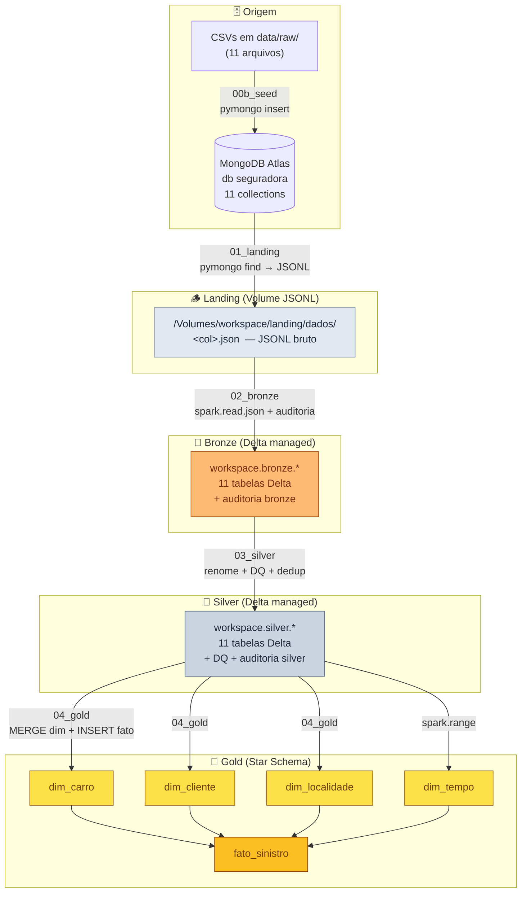
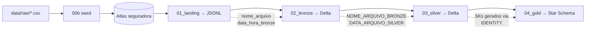

---
tags:
  - arquitetura
  - medallion
  - delta lake
---

# :material-sitemap: Arquitetura

Visão completa do pipeline — do dado bruto no MongoDB Atlas até o star schema analítico no Gold.

---

## :material-transit-connection-variant: Fluxo de Dados

---

## :material-layers-triple-outline: Camadas

-   :material-database-arrow-down:{ .lg .middle } **Landing**

    ---

    **Volume:** `workspace.landing.dados`  
    **Formato:** JSONL (1 arquivo por collection)  
    Dump bruto do MongoDB — sem transformação, dado como veio.

    [:octicons-arrow-right-24: Detalhes](camadas/landing.md)

-   :material-layers-plus:{ .lg .middle } **Bronze**

    ---

    **Schema:** `workspace.bronze`  
    **Formato:** Delta Lake managed  
    Ingestão com `spark.read.json` + colunas de auditoria.

    [:octicons-arrow-right-24: Detalhes](camadas/bronze.md)

-   :material-shield-check:{ .lg .middle } **Silver**

    ---

    **Schema:** `workspace.silver`  
    **Formato:** Delta Lake managed  
    Renome (UPPER + expansão), trim, dedup, DQ, auditoria silver.

    [:octicons-arrow-right-24: Detalhes](camadas/silver.md)

-   :material-star-four-points:{ .lg .middle } **Gold**

    ---

    **Schema:** `workspace.gold`  
    **Formato:** Delta Lake managed  
    4 dimensões + 1 fato — star schema Ralph Kimball.

    [:octicons-arrow-right-24: Detalhes](camadas/gold.md)

---

## :material-lightbulb-outline: Decisões-Chave

| # | Decisão | Motivo |
|---|---------|--------|
| 1 | **Origem MongoDB Atlas** (não-relacional) | Cumpre o requisito de "banco relacional ou não relacional" |
| 2 | **Driver `pymongo`** (driver-side, sem Spark Connector) | Funciona em Serverless Compute do Free Edition; não exige Maven nem configuração de cluster custom |
| 3 | **Formato Landing: JSONL** | `spark.read.json` lê nativamente sem `multiLine`; um doc por linha = paralelismo natural |
| 4 | **Delta managed em todas as camadas** | Padrão do modelo do professor e do Databricks Free Edition |
| 5 | **Catálogo `workspace`** | Único catálogo disponível no Free Edition |
| 6 | **Schemas separados por camada** | `landing`, `bronze`, `silver`, `gold` — isolamento e controle de acesso claros |
| 7 | **Star schema com 4 dim + 1 fato** | Espelha o notebook 004 do professor; padrão Kimball para BI |
| 8 | **SCD Type 1 via `MERGE`** | Mesma técnica do professor; simplicity sobre historicização |
| 9 | **Job com 5 tasks sequenciais** | Atende ao requisito "Jobs & Pipelines encadeado" — DAG linear e reproduzível |

---

## :material-cog-outline: Plataforma

!!! info "Databricks Free Edition"
    O projeto roda inteiramente no **Databricks Free Edition** (tier gratuito).
    Isso implica algumas restrições importantes:

    - Único catálogo disponível: `workspace`
    - Compute: **Serverless** (sem cluster próprio configurável)
    - Sem suporte nativo a Spark Connector for MongoDB (requer Maven) → solução: `pymongo`
    - Volumes do Unity Catalog disponíveis para armazenamento de arquivos

!!! tip "MongoDB Atlas M0"
    O cluster **M0 Free** do Atlas suporta até 512 MB de dados — mais do que suficiente
    para os volumes acadêmicos deste projeto. A connection string usa o protocolo
    `mongodb+srv://` (DNS seedlist) que funciona de qualquer IP, desde que o Network
    Access esteja liberado.

---

## :material-source-branch: Rastreabilidade de Linhagem

Cada camada preserva colunas de auditoria que permitem rastrear a origem de qualquer
registro até o arquivo JSONL — e deste até a collection MongoDB original.
