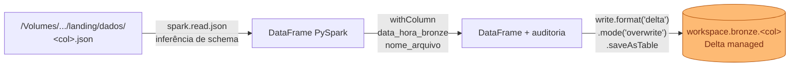

---
tags:
  - bronze
  - delta lake
  - ingestão
---

# :material-layers-plus: Camada Bronze

<p class="accent-bronze"><strong>Dado ingerido com rastreabilidade.</strong> Fiel ao JSONL, mais auditoria.</p>

A Bronze é a primeira camada **Delta Lake** do lakehouse. Ingere os arquivos JSONL da Landing
e materializa 11 tabelas Delta managed com colunas de auditoria para rastreabilidade.

---

## :material-database-outline: Schema

**`workspace.bronze`** — 11 tabelas Delta managed.

| Tabela | Origem Landing |
|--------|---------------|
| `bronze.apolice` | `apolice.json` |
| `bronze.carro` | `carro.json` |
| `bronze.cliente` | `cliente.json` |
| `bronze.endereco` | `endereco.json` |
| `bronze.estado` | `estado.json` |
| `bronze.marca` | `marca.json` |
| `bronze.modelo` | `modelo.json` |
| `bronze.municipio` | `municipio.json` |
| `bronze.regiao` | `regiao.json` |
| `bronze.sinistro` | `sinistro.json` |
| `bronze.telefone` | `telefone.json` |

---

## :material-file-code-outline: Notebook

**`02_bronze_ingestao.py`** — lê JSONL do Volume e grava tabelas Delta.



---

## :material-cog-sync-outline: Comportamento

Para cada um dos **11 arquivos JSONL** em `landing.dados`:

- [ ] `spark.read.json(path)` — inferência automática de schema pelo Spark
- [ ] Adiciona coluna `data_hora_bronze` = `current_timestamp()`
- [ ] Adiciona coluna `nome_arquivo` = `"<col>.json"` (literal)
- [ ] `write.format("delta").mode("overwrite").saveAsTable("bronze.<col>")`

!!! note "Inferência de Schema"
    O Spark infere o schema automaticamente a partir do JSONL. Como o dado veio
    diretamente do MongoDB (documentos homogêneos), a inferência é confiável.
    Em caso de documentos heterogêneos, considere usar `schema_of_json` explícito.

---

## :material-plus-box-outline: Colunas de Auditoria

Todas as tabelas Bronze possuem, além das colunas do documento original:

`data_hora_bronze`
:   `timestamp` — momento exato da ingestão no Bronze.

`nome_arquivo`
:   `string` — nome do arquivo JSONL de origem (ex: `"apolice.json"`).
    Permite rastrear qual arquivo gerou cada linha.

---

## :material-check-circle-outline: Validação

```sql
-- Verificar que as 11 tabelas foram criadas
SHOW TABLES IN bronze;

-- Confirmar que é Delta managed (location interna ao catálogo)
DESCRIBE DETAIL bronze.apolice;

-- Contar registros
SELECT COUNT(*) AS total FROM bronze.apolice;

-- Inspecionar colunas de auditoria
SELECT _id, data_hora_bronze, nome_arquivo FROM bronze.apolice LIMIT 5;
```

---

!!! warning "Mode overwrite"
    A estratégia é `overwrite` completo. Em re-execuções do Job, os dados são
    substituídos — **não acumulados**. Isso é intencional para um pipeline de
    carga full (volume acadêmico pequeno).

!!! success "Delta Lake managed"
    Tabelas **managed** têm localização gerenciada pelo Unity Catalog.
    Ao executar `DROP TABLE bronze.apolice`, os dados também são removidos.
    Isso simplifica o ciclo de vida sem exigir gerenciamento manual de paths.
