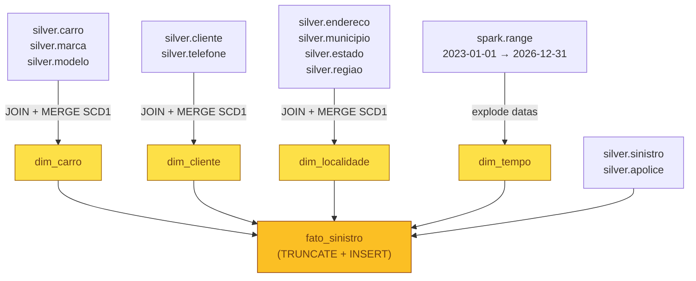

---
tags:
  - gold
  - star schema
  - kimball
  - modelagem dimensional
---

# :material-star-four-points: Camada Gold

<p class="accent-gold"><strong>Star schema Ralph Kimball.</strong> Dados prontos para análise e BI.</p>

A Gold é a camada de consumo. Implementa um **star schema** com 4 dimensões e 1 tabela
fato, seguindo as diretrizes do professor (notebook 004) e as boas práticas de
modelagem dimensional de Ralph Kimball.

---

## :material-database-outline: Schema

**`workspace.gold`** — 5 tabelas Delta managed.

| Tabela | Tipo | Estratégia de Carga |
|--------|------|---------------------|
| `gold.dim_carro` | Dimensão | `MERGE INTO` — SCD Type 1 |
| `gold.dim_cliente` | Dimensão | `MERGE INTO` — SCD Type 1 |
| `gold.dim_localidade` | Dimensão | `MERGE INTO` — SCD Type 1 |
| `gold.dim_tempo` | Dimensão | `spark.range` — gerada programaticamente |
| `gold.fato_sinistro` | Fato | `TRUNCATE + INSERT INTO` — full reload |

---

## :material-file-code-outline: Notebook

**`04_gold_dimensional.py`** — constrói o star schema a partir da Silver.



---

## :material-swap-horizontal: Estratégias de Carga

=== "Dimensões (SCD Type 1)"

    As dimensões `dim_carro`, `dim_cliente` e `dim_localidade` usam **MERGE INTO**
    com SCD Type 1 — sem histórico, apenas atualização do valor corrente:

    ```sql
    MERGE INTO gold.dim_carro AS target
    USING staging_carro AS source
    ON target.PLACA = source.PLACA
    WHEN MATCHED THEN
      UPDATE SET target.MARCA = source.MARCA, ...
    WHEN NOT MATCHED THEN
      INSERT (PLACA, MARCA, MODELO, COR, ANO, CHASSI)
      VALUES (source.PLACA, source.MARCA, ...)
    ```

    A surrogate key `SK_*` é gerada via **`BIGINT GENERATED ALWAYS AS IDENTITY`**.

=== "dim_tempo (range)"

    `dim_tempo` é gerada programaticamente — não depende do Silver:

    ```python
    from pyspark.sql import functions as F

    df_datas = spark.range(0, 1461).select(  # 4 anos × 365,25 dias
        F.expr("date_add('2023-01-01', CAST(id AS INT))").alias("Data")
    ).select(
        F.col("Data"),
        F.year("Data").alias("Ano"),
        F.month("Data").alias("Mes"),
        F.date_format("Data", "MMMM").alias("NomeMes"),
        F.dayofmonth("Data").alias("Dia"),
        F.date_format("Data", "EEEE").alias("NomeDiaSemana"),
        F.dayofweek("Data").alias("NumeroDiaSemana"),
    )
    ```

    Range: **`2023-01-01`** a **`2026-12-31`** (~1.461 dias).

=== "fato_sinistro (full reload)"

    A fato usa `TRUNCATE + INSERT` — carga full a cada execução:

    ```sql
    TRUNCATE TABLE gold.fato_sinistro;

    INSERT INTO gold.fato_sinistro
    SELECT
        s.DATA_SINISTRO           AS FK_TEMPO,
        l.SK_LOCALIDADE           AS FK_LOCALIDADE,
        c.SK_CARRO                AS FK_CARRO,
        cl.SK_CLIENTE             AS FK_CLIENTE,
        COUNT(1)                  AS QTDE_SINISTRO
    FROM silver.sinistro s
    INNER JOIN gold.dim_localidade l ON ...
    INNER JOIN gold.dim_carro      c ON ...
    INNER JOIN gold.dim_cliente    cl ON ...
    GROUP BY s.DATA_SINISTRO, l.SK_LOCALIDADE, c.SK_CARRO, cl.SK_CLIENTE;
    ```

    **Grão:** 1 linha por `(dia × localidade × carro × cliente)`.

---

## :material-check-circle-outline: Validação

```sql
-- Verificar todas as 5 tabelas
SHOW TABLES IN gold;

-- Contagens esperadas
SELECT COUNT(*) AS total_fatos FROM gold.fato_sinistro;       -- > 0
SELECT COUNT(*) AS carros      FROM gold.dim_carro;
SELECT COUNT(*) AS clientes    FROM gold.dim_cliente;
SELECT COUNT(*) AS localidades FROM gold.dim_localidade;
SELECT COUNT(*) AS datas       FROM gold.dim_tempo;           -- ~1461

-- Query analítica de exemplo — sinistros por ano e estado
SELECT
    t.Ano,
    l.NOME_ESTADO,
    SUM(f.QTDE_SINISTRO) AS total_sinistros
FROM gold.fato_sinistro f
INNER JOIN gold.dim_tempo       t  ON f.FK_TEMPO      = t.Data
INNER JOIN gold.dim_localidade  l  ON f.FK_LOCALIDADE = l.SK_LOCALIDADE
GROUP BY t.Ano, l.NOME_ESTADO
ORDER BY total_sinistros DESC;
```

---

!!! success "Star Schema Kimball"
    A Gold implementa fielmente o modelo dimensional do professor:
    4 dimensões desnormalizadas + 1 tabela fato com métricas de negócio.
    As surrogate keys garantem independência das chaves naturais e permitem
    SCD futuros sem impacto na fato.

!!! abstract "Veja também"
    O dicionário completo de colunas, com tipos e descrições, está em
    **[Modelo Dimensional](../modelo-dimensional.md)**.
