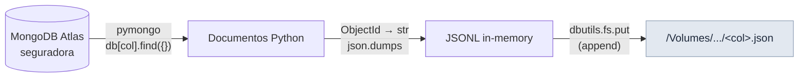

---
tags:
  - landing
  - mongodb
  - jsonl
---

# :material-database-arrow-down: Camada Landing

<p class="accent-landing"><strong>Dado bruto — sem transformação.</strong> O que saiu do MongoDB é o que fica.</p>

A Landing é a zona de pouso do dado. Seu único papel é capturar fielmente os documentos
do MongoDB Atlas e materializá-los como arquivos **JSONL** em um Volume do Unity Catalog.

---

## :material-folder-outline: Volumes

| Volume | Path | Conteúdo |
|--------|------|----------|
| `workspace.landing.dados` | `/Volumes/workspace/landing/dados/` | Arquivos JSONL — output da extração |
| `workspace.landing.csv_raw` | `/Volumes/workspace/landing/csv_raw/` | CSVs originais — input do seed (upload manual) |

---

## :material-file-code-outline: Notebook

**`01_landing_extracao_mongo.py`** — executa a extração do MongoDB para o Volume.



---

## :material-cog-sync-outline: Comportamento

!!! info "Credencial MongoDB"
    O notebook busca `MONGODB_URI` pela seguinte ordem de prioridade:

    1. **Secret Scope** (`scope=mongo`, `key=uri`) — recomendado para Jobs
    2. **Widget Databricks** (`dbutils.widgets.get("MONGODB_URI")`) — fallback manual

    Se nenhum dos dois estiver configurado, o notebook lança `AssertionError` com
    mensagem explicativa.

O fluxo para cada uma das **11 collections**:

- [ ] Conecta no banco `seguradora` via `MongoClient(uri)`
- [ ] Executa `db[col].find({})` para trazer todos os documentos
- [ ] Converte `ObjectId` do campo `_id` para `str` (necessário para serialização JSON)
- [ ] Serializa cada documento como uma linha JSON (formato **JSONL**)
- [ ] Grava em `/Volumes/workspace/landing/dados/<col>.json`

---

## :material-folder-check-outline: Saída Esperada

Após execução bem-sucedida, o Volume `landing.dados` deve conter:

```
/Volumes/workspace/landing/dados/
├── apolice.json
├── carro.json
├── cliente.json
├── endereco.json
├── estado.json
├── marca.json
├── modelo.json
├── municipio.json
├── regiao.json
├── sinistro.json
└── telefone.json
```

---

## :material-check-circle-outline: Validação

=== "SQL (Databricks SQL Editor)"

    ```sql
    -- Listar arquivos no Volume
    LIST '/Volumes/workspace/landing/dados/';
    ```

=== "Python (em notebook)"

    ```python
    # Listar arquivos
    display(dbutils.fs.ls('/Volumes/workspace/landing/dados'))

    # Inspecionar primeiras linhas de um arquivo
    import json
    with open('/Volumes/workspace/landing/dados/apolice.json') as f:
        for i, line in enumerate(f):
            print(json.loads(line))
            if i >= 4:
                break
    ```

=== "PySpark"

    ```python
    df = spark.read.json('/Volumes/workspace/landing/dados/apolice.json')
    df.printSchema()
    df.show(5, truncate=False)
    ```

---

!!! warning "Re-execução"
    O notebook usa `overwrite` no `dbutils.fs.put`. Rodar mais de uma vez substitui
    os arquivos — comportamento seguro para re-ingestão completa.

!!! tip "Por que JSONL e não JSON?"
    O formato JSONL (um objeto JSON por linha) é **ideal para `spark.read.json`**: o Spark
    lê cada linha como um registro independente, sem necessidade de `multiLine=True`,
    o que melhora o paralelismo e a tolerância a falhas.
