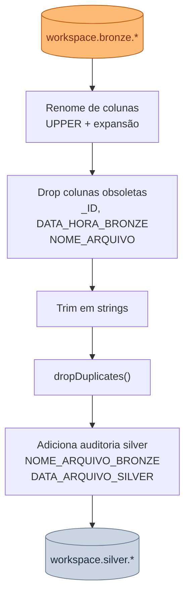

---
tags:
  - silver
  - data quality
  - transformação
---

# :material-shield-check: Camada Silver

<p class="accent-silver"><strong>Dado limpo, nomeado e deduplicado.</strong> Pronto para modelagem analítica.</p>

A Silver aplica as regras de **Data Quality** sobre o Bronze: padroniza nomes de colunas,
remove duplicatas, faz trim, descarta colunas temporárias e adiciona auditoria própria.

---

## :material-database-outline: Schema

**`workspace.silver`** — 11 tabelas Delta managed com DQ aplicado.

---

## :material-file-code-outline: Notebook

**`03_silver_data_quality.py`** — transforma Bronze em Silver.



---

## :material-format-text: Regras de Data Quality

### 1. Renome de Colunas

Todas as colunas são renomeadas para **UPPER CASE** com expansão de prefixos/sufixos
de acordo com o padrão corporativo:

| Prefixo/Sufixo original | Expansão |
|------------------------|----------|
| `CD_` | `CODIGO_` |
| `VL_` | `VALOR_` |
| `DT_` | `DATA_` |
| `NM_` | `NOME_` |
| `DS_` | `DESCRICAO_` |
| `NR_` | `NUMERO_` |
| `_UF` | `_UNIDADE_FEDERATIVA` |

!!! example "Exemplo"
    `cd_cliente` → `CODIGO_CLIENTE`  
    `nm_estado` → `NOME_ESTADO`  
    `dt_sinistro` → `DATA_SINISTRO`

---

### 2. Drop de Colunas Obsoletas

As seguintes colunas são removidas na Silver — não têm semântica no Data Warehouse:

`_ID`
:   ID interno do MongoDB (ObjectId convertido em string). Não é uma chave de negócio.

`DATA_HORA_BRONZE`
:   Auditoria da camada Bronze — substituída pela auditoria Silver.

`NOME_ARQUIVO`
:   Nome do arquivo JSONL — substituído por `NOME_ARQUIVO_BRONZE` para manter rastreabilidade.

---

### 3. Trim em Strings

`trim()` aplicado em todas as colunas do tipo `StringType`. Remove espaços em branco
no início e no final que podem vir de valores do MongoDB.

---

### 4. Deduplicação

`df.dropDuplicates()` — proteção contra re-ingestão acidental. Se um documento vier
duplicado do MongoDB (ou o notebook for executado duas vezes sobre o mesmo Bronze),
a Silver mantém apenas uma cópia.

---

### 5. Colunas de Auditoria Silver

`NOME_ARQUIVO_BRONZE`
:   `string` — rastreabilidade: qual tabela Bronze originou esta linha (ex: `"bronze.apolice"`).

`DATA_ARQUIVO_SILVER`
:   `timestamp` — momento exato da carga no Silver.

---

## :material-check-circle-outline: Validação

```sql
-- Verificar que as 11 tabelas foram criadas
SHOW TABLES IN silver;

-- Inspecionar nomes das colunas (devem estar em CAIXA_ALTA com prefixos expandidos)
DESCRIBE TABLE silver.apolice;

-- Verificar que _id e colunas de auditoria bronze foram removidos
SELECT * FROM silver.apolice LIMIT 5;

-- Contar registros (deve ser igual ou menor ao Bronze — dedup)
SELECT
  (SELECT COUNT(*) FROM bronze.apolice) AS bronze_count,
  (SELECT COUNT(*) FROM silver.apolice) AS silver_count;
```

---

!!! tip "Por que não criar chaves surrogate na Silver?"
    As surrogate keys (SK_*) são criadas apenas na **Gold** via `IDENTITY`. A Silver
    mantém as chaves de negócio originais (ex: `CODIGO_CLIENTE`, `PLACA`) para
    preservar a rastreabilidade e simplificar os `MERGE` na Gold.

!!! abstract "Estratégia de carga"
    Assim como no Bronze, a Silver usa `mode("overwrite")` — carga full. Para volumes
    maiores em produção, considerar carga incremental com Delta Lake Change Data Feed.
