---
tags:
  - visão geral
  - medallion
  - databricks
---

:material-layers-triple-outline: Trabalho 3 · Arquitetura Medallion

# Lakehouse Medalhão { .hero-title }

  Pipeline completo <strong>Landing → Bronze → Silver → Gold</strong> construído sobre
  <strong>Databricks Free Edition</strong> + <strong>MongoDB Atlas</strong>, com Delta Lake,
  Unity Catalog e star schema <em>Ralph Kimball</em> para o domínio de seguros de automóvel.

[:material-rocket-launch: Começar agora](runbook-databricks.md){ .md-button .md-button--primary }
[:material-sitemap: Ver Arquitetura](arquitetura.md){ .md-button }

---

## :material-layers-triple: Camadas do Lakehouse

-   :material-database-arrow-down:{ .lg .middle } **Landing**

    ---

    Dump bruto do MongoDB Atlas em arquivos **JSONL** gravados em um Volume do
    Unity Catalog. Sem transformação — dado como veio.

    [:octicons-arrow-right-24: Saiba mais](camadas/landing.md)

-   :material-layers-plus:{ .lg .middle } **Bronze**

    ---

    Ingestão dos JSONL via `spark.read.json` para tabelas **Delta Lake managed**,
    com colunas de auditoria (`data_hora_bronze`, `nome_arquivo`).

    [:octicons-arrow-right-24: Saiba mais](camadas/bronze.md)

-   :material-shield-check:{ .lg .middle } **Silver**

    ---

    Aplicação de **Data Quality**: renome de colunas para padrão UPPER, trim, dedup
    e troca da auditoria bronze por auditoria silver.

    [:octicons-arrow-right-24: Saiba mais](camadas/silver.md)

-   :material-star-four-points:{ .lg .middle } **Gold**

    ---

    Star schema Kimball com **4 dimensões + 1 fato**. Dimensões via `MERGE` (SCD Type 1);
    fato via `TRUNCATE + INSERT`.

    [:octicons-arrow-right-24: Saiba mais](camadas/gold.md)

---

## :material-cube-outline: Stack Tecnológico

-   :simple-databricks:{ .lg .middle } **Databricks Free Edition**

    ---

    Serverless Compute, Unity Catalog, Volumes e Jobs — tudo sem custos.

-   :material-leaf:{ .lg .middle } **MongoDB Atlas M0**

    ---

    Cluster gratuito na nuvem. Fonte dos 11 documentos do domínio de seguros.

-   :material-triangle:{ .lg .middle } **Delta Lake**

    ---

    Formato de tabela ACID em todas as camadas. Suporte a `MERGE`, time-travel e
    schema enforcement nativos.

-   :material-language-python:{ .lg .middle } **PySpark + pymongo**

    ---

    `pymongo` para extração (compatível com Serverless), PySpark para transformações
    e cargas em escala.

---

## :material-transit-connection-variant: Como funciona o Pipeline

```mermaid
flowchart LR
    A[":simple-mongodb: MongoDB Atlas\n11 collections"] -->|"01_landing\npymongo → JSONL"| B
    B[":material-file-code: Volume JSONL\nlanding.dados"] -->|"02_bronze\nspark.read.json"| C
    C[":material-delta: Bronze\n11 tabelas Delta"] -->|"03_silver\nDQ + renome"| D
    D[":material-delta: Silver\n11 tabelas Delta"] -->|"04_gold\nMERGE + INSERT"| E
    E[":material-star-four-points: Gold\n4 dim + 1 fato"]

    style A fill:#15803d,color:#fff,stroke:#166534
    style B fill:#e2e8f0,stroke:#94a3b8,color:#1e293b
    style C fill:#fdba74,stroke:#b45309,color:#7c2d12
    style D fill:#cbd5e1,stroke:#64748b,color:#1e293b
    style E fill:#fde047,stroke:#a16207,color:#713f12
```

O Job `pipeline_seguradora_medalhao` orquestra **5 tasks sequenciais** no Databricks,
cada uma executando um notebook em Serverless Compute:

| # | Task | Notebook | Ação |
|---|------|----------|------|
| 1 | `setup` | `00_setup_ambiente` | Cria schemas e volumes |
| 2 | `landing` | `01_landing_extracao_mongo` | Extrai MongoDB → JSONL |
| 3 | `bronze` | `02_bronze_ingestao` | JSONL → Delta Bronze |
| 4 | `silver` | `03_silver_data_quality` | Bronze → Silver (DQ) |
| 5 | `gold` | `04_gold_dimensional` | Silver → Gold (star schema) |

---

## :material-bookshelf: Onde Começar

-   :material-map-outline:{ .lg .middle } **Visão Arquitetural**

    ---

    Decisões de design, diagrama de fluxo completo e quadro de decisões-chave.

    [:octicons-arrow-right-24: Arquitetura](arquitetura.md)

-   :material-connection:{ .lg .middle } **Setup MongoDB Atlas**

    ---

    Criar o cluster M0 gratuito, liberar rede e obter a connection string — em
    menos de 10 minutos.

    [:octicons-arrow-right-24: Setup MongoDB](setup-mongo.md)

-   :material-play-circle-outline:{ .lg .middle } **Executar o Pipeline**

    ---

    Runbook passo a passo: desde clonar o repo no Databricks até validar o star
    schema no SQL Editor.

    [:octicons-arrow-right-24: Runbook Databricks](runbook-databricks.md)

-   :material-table-star:{ .lg .middle } **Modelo Dimensional**

    ---

    Dicionário de colunas, diagrama ER e exemplos de queries analíticas no Gold.

    [:octicons-arrow-right-24: Modelo Dimensional](modelo-dimensional.md)

---

## :material-information-outline: Sobre o Projeto

!!! abstract "Contexto Acadêmico"
    Este projeto é o **Trabalho 3** de uma disciplina de Engenharia de Dados.
    O objetivo é demonstrar a arquitetura **Medallion** em uma plataforma cloud moderna,
    partindo de uma fonte não-relacional (MongoDB) e entregando dados analíticos
    prontos para consumo no Gold.

**Domínio:** Seguros de automóvel · **11 collections** · **5 tabelas Gold**

**Repositório:** [:fontawesome-brands-github: gustavofelisbino/Databricks-Lakehouse-Medalhao-Mongo](https://github.com/gustavofelisbino/Databricks-Lakehouse-Medalhao-Mongo)
