---
tags:
  - job
  - pipeline
  - databricks
  - orquestração
---

# :material-pipe: Job & Pipeline

Orquestração completa do pipeline via **Databricks Jobs** — 5 tasks sequenciais que
executam o lakehouse do setup ao Gold em uma única execução.

---

## :material-information-outline: Configuração do Job

| Propriedade | Valor |
|-------------|-------|
| **Nome** | `pipeline_seguradora_medalhao` |
| **Compute** | Serverless (padrão Free Edition) |
| **Trigger** | Manual (`Run now`) |
| **Max concurrent runs** | 1 |
| **Retries por task** | 1 |

---

## :material-graph: DAG do Pipeline

```mermaid
flowchart LR
    S["⚙️ setup\n00_setup_ambiente"]
    L["🪵 landing\n01_landing_extracao_mongo"]
    B["🥉 bronze\n02_bronze_ingestao"]
    SL["🥈 silver\n03_silver_data_quality"]
    G["🥇 gold\n04_gold_dimensional"]

    S -->|"schemas +\nvolumes"| L
    L -->|"JSONL\nno Volume"| B
    B -->|"11 tabelas\nDelta"| SL
    SL -->|"11 tabelas\nDQ"| G

    style S fill:#6366f1,color:#fff,stroke:#4338ca
    style L fill:#e2e8f0,stroke:#94a3b8,color:#1e293b
    style B fill:#fdba74,stroke:#b45309,color:#7c2d12
    style SL fill:#cbd5e1,stroke:#64748b,color:#1e293b
    style G fill:#fde047,stroke:#a16207,color:#713f12
```



5 tasks com **dependência linear estrita** — cada task só inicia após a anterior
completar com sucesso.

---

## :material-file-yaml-outline: Asset Bundle (`databricks_job.yml`)

Definição declarativa do Job versionada no repositório. Permite recriar o Job
em qualquer workspace via Databricks CLI:

```bash
# Autenticar no workspace
databricks auth login --host https://<seu-workspace>.cloud.databricks.com

# Fazer deploy do bundle
databricks bundle deploy --target dev
```

!!! note "Databricks CLI"
    Requer **Databricks CLI v0.200+** instalado e autenticado no workspace.
    Veja a [documentação oficial](https://docs.databricks.com/dev-tools/cli/index.html).

Estrutura do `databricks_job.yml`:

```yaml
bundle:
  name: pipeline_seguradora_medalhao

resources:
  jobs:
    pipeline_seguradora_medalhao:
      name: pipeline_seguradora_medalhao
      max_concurrent_runs: 1
      tasks:
        - task_key: setup
          notebook_task:
            notebook_path: ./notebooks/00_setup_ambiente.py
          max_retries: 1

        - task_key: landing
          depends_on: [{task_key: setup}]
          notebook_task:
            notebook_path: ./notebooks/01_landing_extracao_mongo.py
            base_parameters:
              MONGODB_URI: "{{secrets/mongo/uri}}"  # (1)!
          max_retries: 1

        - task_key: bronze
          depends_on: [{task_key: landing}]
          notebook_task:
            notebook_path: ./notebooks/02_bronze_ingestao.py
          max_retries: 1

        - task_key: silver
          depends_on: [{task_key: bronze}]
          notebook_task:
            notebook_path: ./notebooks/03_silver_data_quality.py
          max_retries: 1

        - task_key: gold
          depends_on: [{task_key: silver}]
          notebook_task:
            notebook_path: ./notebooks/04_gold_dimensional.py
          max_retries: 1
```

1. A referência `{{secrets/mongo/uri}}` injeta o valor do Secret Scope em tempo
   de execução — sem expor a credential no YAML.

---

## :material-mouse: Criação Manual via UI

Se preferir não usar o CLI, o Job pode ser criado diretamente na UI do Databricks:

- [ ] Databricks UI → **Jobs & Pipelines** → **Create Job**
- [ ] Nome: `pipeline_seguradora_medalhao`
- [ ] Adicionar **5 tasks** (Type: Notebook), apontando para o notebook do Git Folder
- [ ] Configurar `Depends on` para criar a cadeia linear:
      `setup → landing → bronze → silver → gold`
- [ ] Em `landing`: adicionar **Job parameter** `MONGODB_URI`
      (ou referenciar o Secret Scope se configurado)
- [ ] Compute: **Serverless** em todas as tasks
- [ ] Max retries: **1** em cada task
- [ ] **Save** → **Run now**

---

## :material-table-clock: Tasks em Detalhe

| # | Task name | Notebook | Depends on | Ação principal |
|---|-----------|----------|------------|----------------|
| 1 | `setup` | `00_setup_ambiente.py` | *(none)* | Cria 4 schemas + 2 volumes em `workspace` |
| 2 | `landing` | `01_landing_extracao_mongo.py` | `setup` | Extrai 11 collections do MongoDB → JSONL |
| 3 | `bronze` | `02_bronze_ingestao.py` | `landing` | JSONL → 11 tabelas Delta Bronze |
| 4 | `silver` | `03_silver_data_quality.py` | `bronze` | Bronze → 11 tabelas Silver com DQ |
| 5 | `gold` | `04_gold_dimensional.py` | `silver` | Silver → 4 dim + 1 fato (star schema) |

---

## :material-clock-outline: Tempo de Execução

!!! tip "Estimativa"
    | Fase | Tempo estimado |
    |------|---------------|
    | Cold start do Serverless | 30–90 s |
    | `setup` | < 30 s |
    | `landing` (extração MongoDB) | 30–60 s |
    | `bronze` (11 tabelas) | 60–120 s |
    | `silver` (11 tabelas) | 60–120 s |
    | `gold` (MERGE + INSERT) | 60–120 s |
    | **Total** | **3–8 min** |

    Execuções subsequentes são mais rápidas — o Serverless fica "morno" por alguns minutos.
