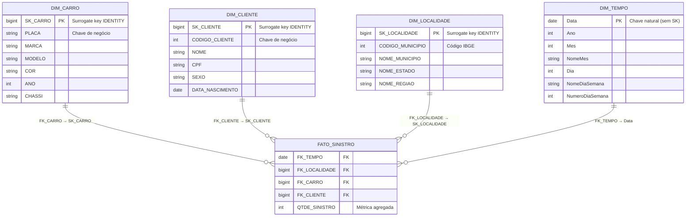

---
tags:
  - modelo dimensional
  - star schema
  - kimball
  - gold
---

# :material-table-star: Modelo Dimensional (Gold)

Star schema baseado no modelo apresentado pelo professor (notebook 004), aplicando
a metodologia **Ralph Kimball** de modelagem dimensional.

---

## :material-transit-connection: Diagrama ER



---

## :material-book-open-variant: Dicionário de Dados

### `gold.dim_carro`

| Coluna | Tipo | Descrição |
|--------|------|-----------|
| `SK_CARRO` | `bigint IDENTITY` | Surrogate key gerada automaticamente |
| `PLACA` | `string` | Placa do veículo — chave de negócio para MERGE |
| `MARCA` | `string` | Marca do fabricante (vem de `silver.marca` via JOIN) |
| `MODELO` | `string` | Modelo do veículo (vem de `silver.modelo` via JOIN) |
| `COR` | `string` | Cor do veículo |
| `ANO` | `int` | Ano de fabricação |
| `CHASSI` | `string` | Número do chassi |

---

### `gold.dim_cliente`

| Coluna | Tipo | Descrição |
|--------|------|-----------|
| `SK_CLIENTE` | `bigint IDENTITY` | Surrogate key gerada automaticamente |
| `CODIGO_CLIENTE` | `int` | Código natural do cliente — chave de negócio para MERGE |
| `NOME` | `string` | Nome completo do cliente |
| `CPF` | `string` | CPF como string — preserva zeros à esquerda |
| `SEXO` | `string` | Sexo declarado (`M` / `F`) |
| `DATA_NASCIMENTO` | `date` | Data de nascimento |

---

### `gold.dim_localidade`

| Coluna | Tipo | Descrição |
|--------|------|-----------|
| `SK_LOCALIDADE` | `bigint IDENTITY` | Surrogate key gerada automaticamente |
| `CODIGO_MUNICIPIO` | `int` | Código IBGE do município — chave de negócio para MERGE |
| `NOME_MUNICIPIO` | `string` | Nome do município |
| `NOME_ESTADO` | `string` | Nome do estado (via JOIN com `silver.estado`) |
| `NOME_REGIAO` | `string` | Região geográfica (Norte, Sul, Sudeste, …) |

---

### `gold.dim_tempo`

| Coluna | Tipo | Descrição |
|--------|------|-----------|
| `Data` | `date` | Data — chave natural (sem surrogate key) |
| `Ano` | `int` | Ano (ex: 2024) |
| `Mes` | `int` | Mês (1–12) |
| `NomeMes` | `string` | Nome do mês em PT-BR (ex: `"Janeiro"`) |
| `Dia` | `int` | Dia do mês (1–31) |
| `NomeDiaSemana` | `string` | Nome do dia da semana em PT-BR (ex: `"Segunda-feira"`) |
| `NumeroDiaSemana` | `int` | 1 = Domingo, 7 = Sábado |

**Range:** `2023-01-01` a `2026-12-31` — aproximadamente **1.461 linhas**.

---

### `gold.fato_sinistro`

| Coluna | Tipo | Descrição |
|--------|------|-----------|
| `FK_TEMPO` | `date` | FK → `dim_tempo.Data` |
| `FK_LOCALIDADE` | `bigint` | FK → `dim_localidade.SK_LOCALIDADE` |
| `FK_CARRO` | `bigint` | FK → `dim_carro.SK_CARRO` |
| `FK_CLIENTE` | `bigint` | FK → `dim_cliente.SK_CLIENTE` |
| `QTDE_SINISTRO` | `int` | Quantidade de sinistros no grão — `COUNT(1)` agregado |

!!! info "Grão da Fato"
    **1 linha por combinação de `(dia, localidade, carro, cliente)`.**

    A métrica `QTDE_SINISTRO` é o `COUNT(1)` de sinistros nesse grão.
    Portanto, se 3 sinistros ocorreram para o mesmo carro, cliente,
    localidade e dia, haverá 1 linha com `QTDE_SINISTRO = 3`.

---

## :material-magnify: Exemplos de Queries Analíticas

=== "Sinistros por ano e estado"

    ```sql
    SELECT
        t.Ano,
        l.NOME_ESTADO,
        SUM(f.QTDE_SINISTRO) AS total_sinistros
    FROM gold.fato_sinistro f
    INNER JOIN gold.dim_tempo       t  ON f.FK_TEMPO      = t.Data
    INNER JOIN gold.dim_localidade  l  ON f.FK_LOCALIDADE = l.SK_LOCALIDADE
    GROUP BY t.Ano, l.NOME_ESTADO
    ORDER BY total_sinistros DESC;
    ```

=== "Top 10 modelos de carro com mais sinistros"

    ```sql
    SELECT
        c.MARCA,
        c.MODELO,
        SUM(f.QTDE_SINISTRO) AS total_sinistros
    FROM gold.fato_sinistro f
    INNER JOIN gold.dim_carro c ON f.FK_CARRO = c.SK_CARRO
    GROUP BY c.MARCA, c.MODELO
    ORDER BY total_sinistros DESC
    LIMIT 10;
    ```

=== "Sazonalidade mensal"

    ```sql
    SELECT
        t.NomeMes,
        t.Mes,
        SUM(f.QTDE_SINISTRO) AS total_sinistros
    FROM gold.fato_sinistro f
    INNER JOIN gold.dim_tempo t ON f.FK_TEMPO = t.Data
    GROUP BY t.NomeMes, t.Mes
    ORDER BY t.Mes;
    ```

---

!!! tip "SCD Type 1"
    As dimensões usam **SCD Type 1** — quando um atributo muda (ex: cliente troca
    de endereço), o valor é **sobrescrito** no `MERGE`. Não há histórico de mudanças.
    Para necessidades de historicização, evoluir para SCD Type 2 com colunas
    `data_inicio`, `data_fim` e `flag_ativo`.
